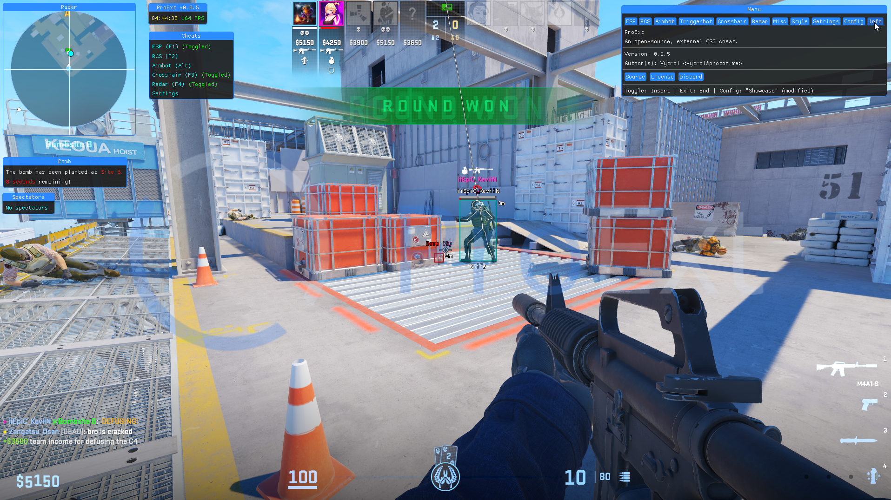

<div align = "center">


_An open-source, customizable cheat for Counter-Strike 2._

</div>

## 🖼️ Preview

<div align="center">



</div>

## 📝 Instructions:

To use ProExt, you can follow two methods.

### Method 1: Download the prebuilt binary

This method is the easiest and is recommended for most. You can find the latest binary [here](https://git.snipcola.com/snipcola/ProExt/raw/branch/main/bin/proext.exe).

### Method 2: Build the application

#### Requirements:

- [PowerShell](https://winget.run/pkg/Microsoft/PowerShell)
- [Git](https://winget.run/pkg/Git/MinGit)
- [Rust](https://rustup.rs)

#### Installation:

1. Clone the repository:

   ```
   git clone https://git.snipcola.com/snipcola/ProExt.git
   ```

2. Enter the directory:

   ```
   cd ProExt
   ```

3. Build the application:

   ```
   ./scripts/deploy.ps1
   ```

4. The binary should be located inside of the `bin` folder.

## ⌨️ Shortcuts:

- `Insert / Ins` - Show/hide the menu.
- `End` - Exits the application.

## 📋 Features:

- ESP
- RCS
- Aimbot
- Triggerbot
- Crosshair
- Radar
- Bomb Timer
- Spectator List
- Styling
- Configuration

## 💬 Q&A:

- **Does it work in fullscreen?**

  No.

- **Game lags when toggled, what's the fix?**

  Run the following, using the developer console:

  ```
  engine_no_focus_sleep 0
  ```
