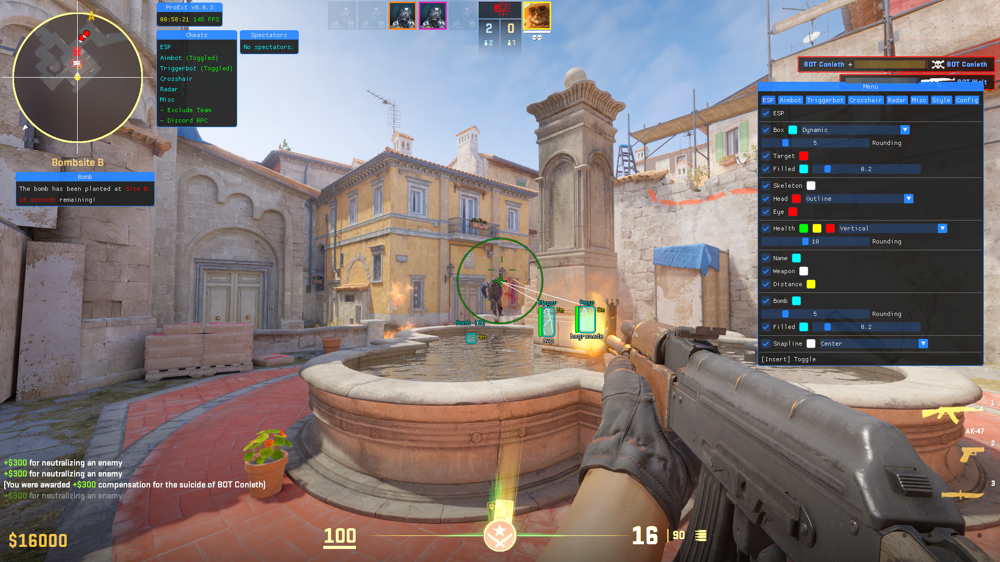

<!---
### 📢 This project is no longer actively maintained, try:
- 👉 [@TKazer/CS2_External](https://github.com/TKazer/CS2_External)
- 👉 [@CowNowK/AimStarCS2](https://github.com/CowNowK/AimStarCS2)
- 👉 [@Valthrun/Valthrun](https://github.com/Valthrun/Valthrun)
-->

## 🎮 ProExt - an External Cheat for Counter-Strike 2

## 📋 Features:
- **ESP 👁️**
- **Aimbot 🎯**
- **Triggerbot 💨**
- **Crosshair ⌖**
- **Radar 📡**
- **Bomb Timer 💣**
- **Spectator List 👀**
- **Styling 🖌️**
- ...and more to come!
## 💬 Q&A:
**🤔  Is this detectable?**  
**Yes, this may be detectable in certain circumstances**, it is a user-mode cheat afterall. *It is important to note that you might not be detected, other factors such as suspicious gameplay also are important to consider.*  
**🤔  FPS drops when focusing on the menu, any way to fix that?**  
**Yes, there is an actual fix for this.** If you have turned on the developer console, you can simply run the following command to resolve this issue: <code>engine_no_focus_sleep 0</code>  
**🤔  My antivirus says "X", is this a virus?**  
**Of course not,** it wouldn't be the brightest of ideas to open source a virus - and you can always build the software yourself if you have concerns with the auto-update system. Why the antivirus flagged the software in the first place could be because of various factors, but likely as this is a cheat.
## 🐛 Known Bugs:
- **⚠️ ESP might not work as expected**, as some players might seem to "teleport" suddenly. I suspect that the data which is being read from the game is sometimes outdated. *Thankfully, this doesn't occur too often - and when it does, it is more times than not the players far away.*  
- **⚠️ The FOV circle might flicker from two different sizes**, this happens mostly when a scope is un(equipped) or the scope's zoom is changed. *An easy workaround is to only enable the FOV circle to adjust your FOV, and then promptly disable it.*  
- **❓ Something missing?** - If you find a bug, you may open an issue on the repository and it will be added here, the bug may also be fixed in a later update.