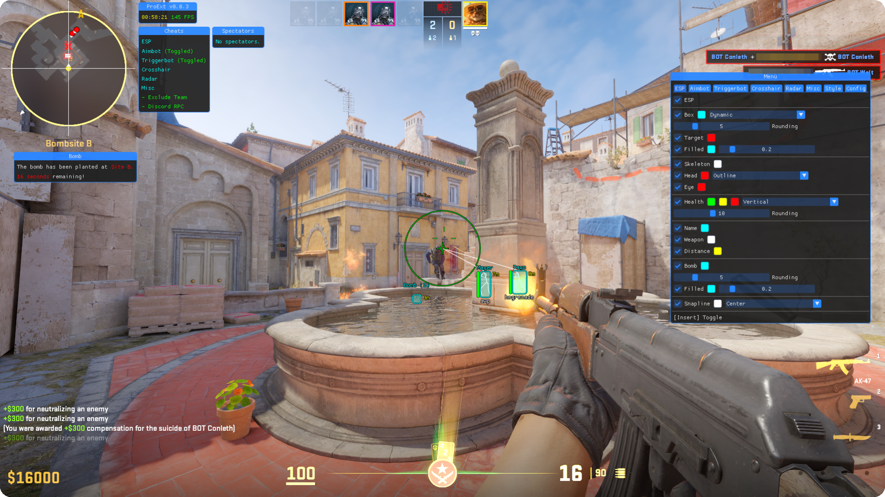

<!--
Copyright (c) 2023 Vytrol <vytrol@proton.me>
SPDX-License-Identifier: MIT
-->

<h1 align="center">
    
</h1>

    
    
    

An open-source, customizable modification for Counter-Strike 2, designed to enhance your gameplay.

<h2>📋 Features:</h2>
<li>ESP</li>
<li>RCS</li>
<li>Aimbot</li>
<li>Triggerbot</li>
<li>Crosshair</li>
<li>Radar</li>
<li>Bomb Timer</li>
<li>Spectator List</li>
<li>Styling</li>
<li>Configuration</li>
<li><i>...and more to come!</i></li>

<h2>💬 Q&A:</h2>
<h4><b>🤔  Is this detectable?</b></h4>

This software operates in user mode, so it is entirely possible to be detected. However, you should always avoid suspicious gameplay to evade potential reports.
