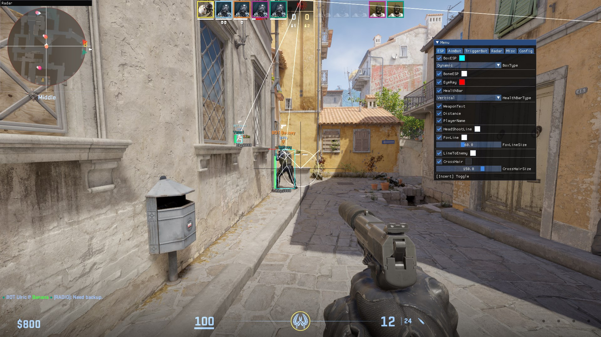

## 🎮 ProExt - an External Cheat for Counter-Strike 2
#### 📖 This repository is for educational purposes.
#### 📥 Want to get in touch? I'm on discord, **@Vytrol**.
#### ©️ This is an ***heavily modified*** rust implementation of **TKazer's** CS2_External project.
## 🎬 Showcase:

## 📋 Features:
- **ESP**: ESP for Bone, Box, Eye Ray, Weapon Name, Player Name, Distance.
- **Aimbot**: Aim Lock via Key, FOV Circle, Visible Check, RCS Control.
- **Triggerbot**: Trigger shoot via Key, optional toggle mode, customizable delay.
- **Radar**: Radar overlay with enemy positions, customizable look, optional crossline.
- **Misc**: Anti Flashbang (Risky), Bunny Hop (Risky), Team Check, Show UI when Spectating, disable cheat capture by OBS, etc.
- **Config**: Create, store, and share configuration files with ease - the config must be valid to load.